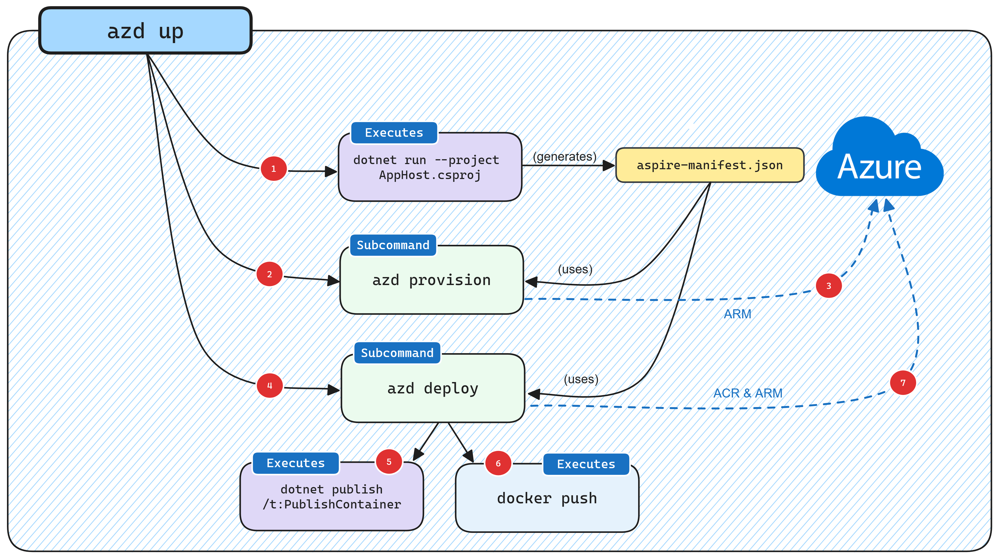

# .NET Aspire Setup and Tooling

**Prerequisite**:
Ensure that [.NET 8.0](https://dotnet.microsoft.com/en-us/download/dotnet/8.0) is installed. And a container runtime support like *Docker*.

## Install latest version of .NET Aspire workload:

```shell
dotnet workload update
```

```shell
dotnet workload install aspire
```

Optionally:

```shell
dotnet workload list
```

## (Optional) Set Container Runtime

.Net Aspire defaults to Docker as a container runtime. But if you have more than one runtime installed, you might want to explicitly set it.
You can either set it to '*docker*' or '*podman*'.

Windows:
```PowerShell
$env:DOTNET_ASPIRE_CONTAINER_RUNTIME = "docker"
```

Unix:
```Bash
export DOTNET_ASPIRE_CONTAINER_RUNTIME=docker
```

# .NET Aspire project templates

*[Source article](https://learn.microsoft.com/en-us/dotnet/aspire/fundamentals/setup-tooling?tabs=dotnet-cli%2Cunix#install-net-aspire)*

There are currently four project templates available:

- .NET Aspire Application: A minimal .NET Aspire app that includes the following:

    - AspireSample.AppHost: An orchestrator project designed to connect and configure the different projects and services of your app.

    - AspireSample.ServiceDefaults: A .NET Aspire shared project to manage configurations that are reused across the projects in your solution related to resilience, service discovery, and telemetry.

- .NET Aspire Starter Application: In addition to the .AppHost and .ServiceDefaults projects, the .NET Aspire Starter Application also includes the following:

    - AspireSample.ApiService: An ASP.NET Core Minimal API project is used to provide data to the frontend. This project depends on the shared AspireSample.ServiceDefaults project.

    - AspireSample.Web: An ASP.NET Core Blazor App project with default .NET Aspire service configurations, this project depends on the AspireSample.ServiceDefaults project.

- .NET Aspire App Host: A standalone .AppHost project that can be used to orchestrate and manage the different projects and services of your app.

- .NET Aspire Test Project (xUnit): A project that contains xUnit.net integration of a .NET Aspire AppHost project.

- .NET Aspire Service Defaults: A standalone .ServiceDefaults project that can be used to manage configurations that are reused across the projects in your solution related to resilience, service discovery, and telemetry.

To see which .NET Aspire projct templates are available, use the `dotnet new list` command, passing in the search term `aspire`:

```shell
dotnet new list aspire
```

You should see the following output:

```
These templates matched your input: 'aspire'

Template Name                     Short Name              Language  Tags
--------------------------------  ----------------------  --------  -------------------------------------------------------
.NET Aspire App Host              aspire-apphost          [C#]      Common/.NET Aspire/Cloud
.NET Aspire Application           aspire                  [C#]      Common/.NET Aspire/Cloud/Web/Web API/API/Service
.NET Aspire Service Defaults      aspire-servicedefaults  [C#]      Common/.NET Aspire/Cloud/Web/Web API/API/Service
.NET Aspire Starter Application   aspire-starter          [C#]      Common/.NET Aspire/Blazor/Web/Web API/API/Service/Cloud
.NET Aspire Test Project (xUnit)  aspire-xunit            [C#]      Common/.NET Aspire/Cloud/Web/Web API/API/Service/Test
```

Then you can create a project template through the cli like so:

```
dotnet new aspire-starter
```

# Startup Order / Readiness

On the topic of startup order of services. As per example of a docker compose utilizing the `depends_on` parameter.

.NET Aspire does not support, and probably will never support, orchestrating startup order. As discussed in this [GitHub Issue](https://github.com/dotnet/aspire/issues/921).

TLDR comment from David Fowler:

"*Controlling startup order of services is something we generally do not want to offer be because notion does not exist in reality when you deploy. There are a few tasks and jobs that you do want to run in some order (migrations for example), but we’re not convinced that adding startup order generally is a positive .*"

# Deploy to Azure Container Apps

*[source article](https://learn.microsoft.com/en-us/dotnet/aspire/deployment/azure/aca-deployment-azd-in-depth?tabs=windows)*



## Prerequisite

Have `Azure Developer CLI` installed.

Windows:
```PowerShell
winget install microsoft.azd
```

Linux:
```Bash
curl -fsSL https://aka.ms/install-azd.sh | bash
```

macOS:
```
brew tap azure/azd && brew install azd
```

## Initialize with `azd init`

In Aspire working directory, with the `Aspire.sln` file in the working directory.
```shell
azd init
```

## Configure CI / CD

```shell
azd auth login
```


## Generate Manifest

```shell
dotnet run --project Aspire.AppHost.csproj -- --publisher manifest --output-path ../aspire-manifest.json
```

## Generate Bicep

```shell
azd provision
```

## Deploy

```shell
azd deploy
```