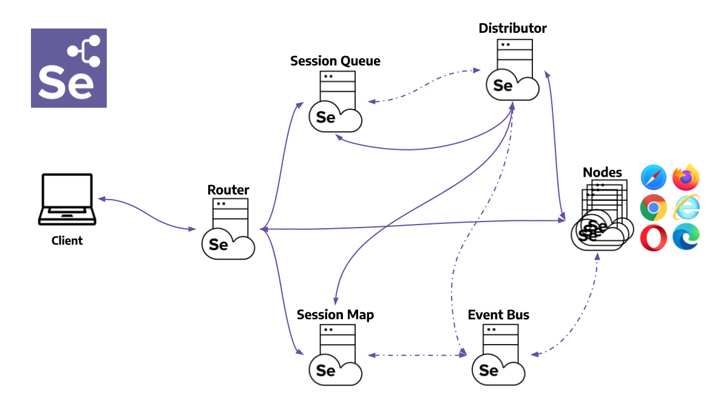

# Table of Contents

- [Selenium Grid Components](#selenium-grid-components)
    - [Router](#router)
    - [Distributor](#distributor)
        - [Register and keep track of all Nodes and their capabilities](#register-and-keep-track-of-all-nodes-and-their-capabilities)
        - [Query the New Session Queue and process any pending new session requests](#query-the-new-session-queue-and-process-any-pending-new-session-requests)
    - [Session Map](#session-map)
    - [New Session Queue](#new-session-queue)
    - [Node](#node)
    - [Event Bus](#event-bus)
- [Configuration](#configuration)
    - [Network](#network)
    - [Video Recording](#video-recording)

<a id="selenium-grid-components"></a>
# Selenium Grid Components

[Source article](https://www.selenium.dev/documentation/grid/components/)



<a id="router"></a>
## Router

The **Router** is the entry point of the Grid, receiving all external requests, and forwards them to the correct component.

If the **Router** receives a new session request, it will be forwarded to the **New Session Queue**.

If the request belongs to an existing session, the **Router** will query the **Session Map** to get the **Node** ID where the session is running, and then the request will be forwarded directly to the **Node**.

The **Router** balances the load in the Grid by sending the requests to the component that is able to handle them better, without overloading any component that is not needed in the process.

<a id="distributor"></a>
## Distributor

A **Distributor** has two main responsibilities:

<a id="register-and-keep-track-of-all-nodes-and-their-capabilities"></a>
### Register and keep track of all Nodes and their capabilities

A **Node** registers to the **Distributor** by sending a **Node** registration event through the **Event Bus**. The **Distributor** reads it, and then tries to reach the **Node** via HTTP to confirm its existence. If the request is successful, the **Distributor** registers the Node and keeps track of all **Nodes** capabilities through the **GridModel**.

<a id="query-the-new-session-queue-and-process-any-pending-new-session-requests"></a>
### Query the New Session Queue and process any pending new session requests

When a new session request is sent to the **Router**, it gets forwarded to the **New Session Queue**, where it will wait in the queue. The **Distributor** will poll the **New Session Queue** for pending new session requests, and then finds a suitable **Node** where the session can be created. After the session has been created, the **Distributor** stores in the **Session Map** the relation between the session id and **Node** where the session is being executed.

<a id="session-map"></a>
## Session Map

The **Session Map** is a data store that keeps the relationship between the session id and the **Node** where the session is running it. It supports the **Router** in the process of forwarding a request to the **Node**. The **Router** will ask the **Session Map** for the **Node** associated to a session id.

<a id="new-session-queue"></a>
## New Session Queue

The **New Session Queue** holds all the new session requests in a First In First Out order. It has configurable parameters for setting the request timeout and request retry interval (how often the timout will be checked).

The **Router** adds the new session request to the **New Session Queue** and waits for the response. The **New Session Queue** regularly checks if any request in the queue has timed out, if so the request is rejected and removed immediately.

The **Distributor** regularly checks if a slot is available. If so, the **Distributor** polls the **New Session Queue** for the first matching request. The **Distributor** then attempts to create a new session.

Once the requested capabilities match the capabilities of any of the free **Node** slots, the **Distributor** attempts to get the available slot. If all the slots are busy, the **Distributor** will send the request back to the queue. If request times out while retrying or adding to the front of the queue, it will be rejected.

After a session is created successfully, the **Distributor** sends the session information to the **New Session Queue**, which then gets sent back to the **Router**, and finally to the client.

<a id="node"></a>
## Node

Runs a [WebDriver session](https://w3c.github.io/webdriver/#dfn-sessions). Each session is assigned to a slot, and each node has one or more slots.

A Grid can contain multiple **Nodes**. Each **Node** manages the slots for the available browsers of the machine where it is running.

The **Node** registers itself to the **Distributor** through the **Event Bus**, and its configuration is sent as part of the registration message.

A **Node** only executes the received commands, it does not evaluate, make judgments, or control anything other than the flow of commands and responses. The machines where the **Node** is running does not need to have the same operating systems as the other components. For example, A Windows **Node** might have the capability of offering IE Mode on Edge as a browser option, whereas this would not be possible on Linux or Mac, and a Grid can have multiple **Nodes** configured with Windows, Mac, or Linux.

<a id="event-bus"></a>
## Event Bus

The **Event Bus** serves as a communication path between the **Nodes**, **Distributor**, **New Session Queue**, and **Session Map**. The Grid does most of its internal communication through messages, avoiding expensive HTTP calls. When starting the grid in its fully distributed mode, the **Event Bus** is the first component that should be started.

<a id="configuration"></a>
# Configuration

<a id="network"></a>
## Network

By default, the Selenium Grid (hub) server is set to bind its port to 4444, specifically to the Docker Daemon IP.
Which means that it's impossible to have other containers attempt to communicate with the Selenium Grid server
without going through the host system's network.
To bypass this; pass the environment variable `host` with the value of `0.0.0.0` to the grid server.
Or configure it through a `config.toml` file under a `[server]` section. Example:

```toml
[server]
host = "0.0.0.0"
```

Configuration for the `hub` and `router` images, should be placed in `/opt/selenium/config.toml`.
Otherwise default to the path `/opt/bin/config.toml`

<a id="video-recording"></a>
## Video Recording

To record a WebDriver session from a `selenium/node-docker`, configure a `video-image` in the `config.toml` file for the docker node: For example:
```
# config.toml
[docker]
video-image = "selenium/video:ffmpeg-6.1-202420220"
```

Then add the options to the WebDriver session to enable video recording. You can do this from the client script:
```csharp
FirefoxOptions options = new FirefoxOptions();
options.AddAdditionalOptions("se:recordVideo", "true");
```

You can also set a time zone and screen resolution:
```csharp
options.AddAdditionalOptions("se:timeZone", "US/Pacific");
options.AddAdditionalOptions("se:screenResolution", "1920x1080");
```

Then made sure you've volume mounted the assets from within the **Docker Node**:
```yaml
docker-node:
    image: selenium/node-docker:4.18.0-20240220
    volumes:
      - ./node-docker/assets:/opt/selenium/assets
```

## Docker Node

The **Docker Node** supports configuration for its spawned [**Nodes**](https://www.selenium.dev/documentation/grid/configuration/cli_options/#node) as well as [itself](https://www.selenium.dev/documentation/grid/configuration/cli_options/#docker). Options that might be worth changing for all spawnes **Nodes** includes: `max-sessions` (to override CPU core default, since there are multiple available browsers), `heartbeat-period`, and `session-timeout`.